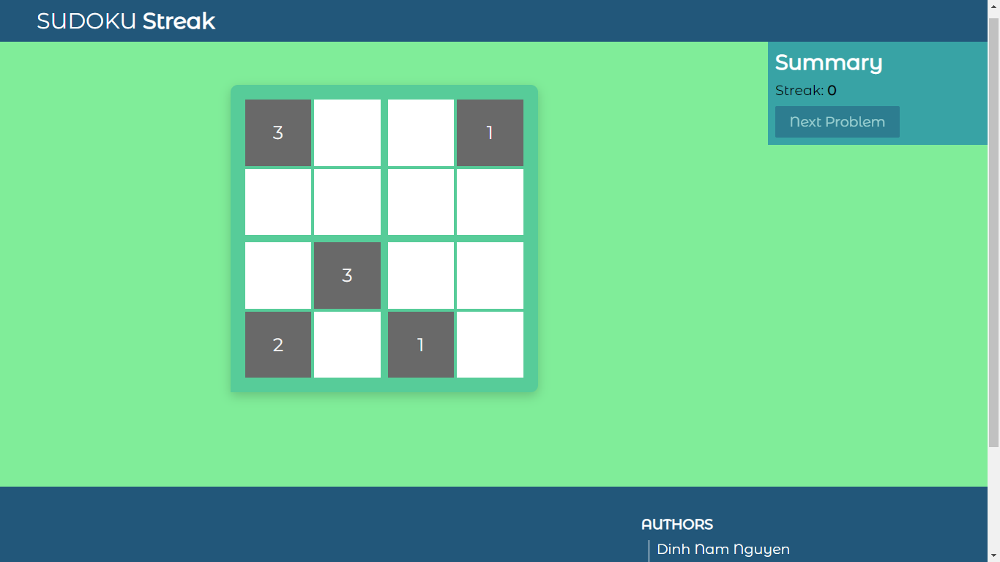

<!-- # 

 -->
<!--  -->

> Welcome and thanks for stopping by! Solve sudoku problems consecutively to increase your Streak.

### **[→ SUDOKU Streak](https://nguyend-nam.github.io/SUDOKU-Streak/)**

<!-- ### How it works:
  - Choose site (Codeforces or AtCoder).
  - Specify the range of difficulty.
  - Click on "Randomize" to start selecting suitable coding problem.
  - *Optional*:
    - Set count-down timer for evaluating your practice.
    - Selecting number of recently added problems that you might get. -->
 

### Features:
  - [X] 4x4 board Sudoku.
  - [X] Streak counting.
  - [ ] 9x9 board Sudoku.

### Authors:

